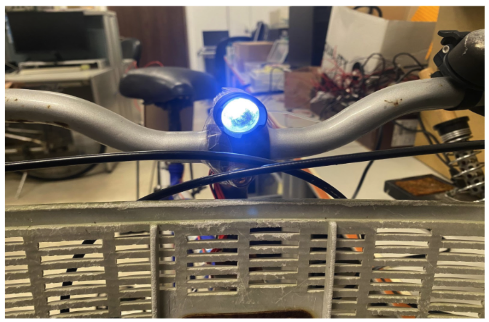

# Bikesla
The final project of Embedded-System Lab, NTUEE

# set up
1. Import Program from http://os.mbed.com/teams/mbed-os-examples/code/mbed-os-example-ble-Button/  
2. Update Libraries, mbed-os.6.15.1  
5. copy codes:  
```bash
cd Bikesla
cp source/* MbedFolder/source/  
cp mbed_app.json MbedFolder  
// MbedFolder  
rm -r shields img  
```
6. change mini_printf to std if needs. (in mbed-os/targets/targets.json::19)

# Images
Here are some images related to the project:

### Control Buttons


### Device Box


### Speed Panel


### Start Button


### Device


### Flash LED


### Speed Sensor

